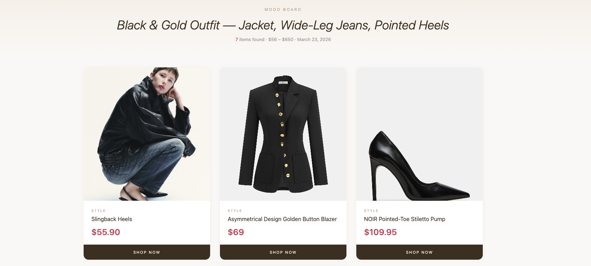
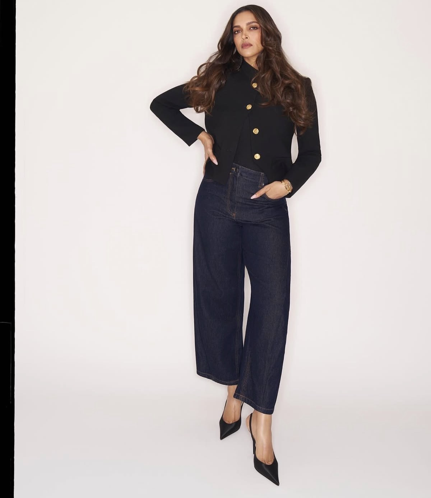
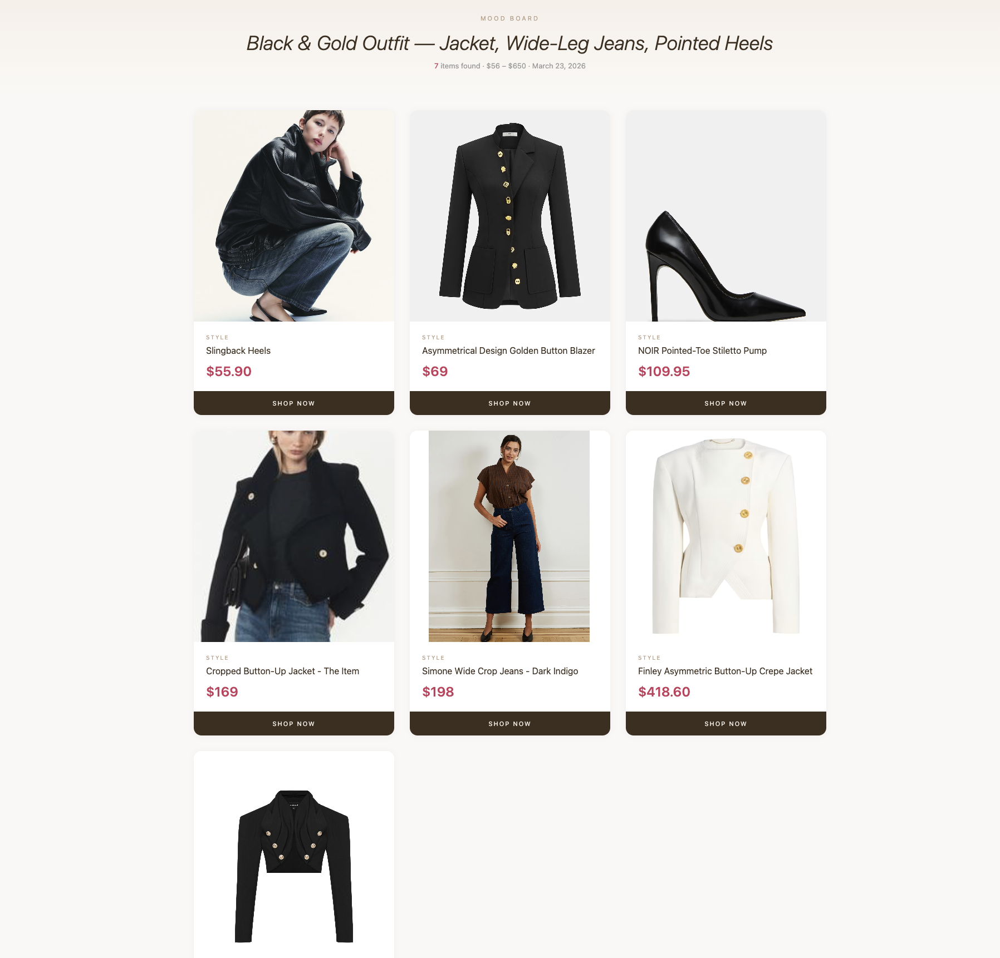
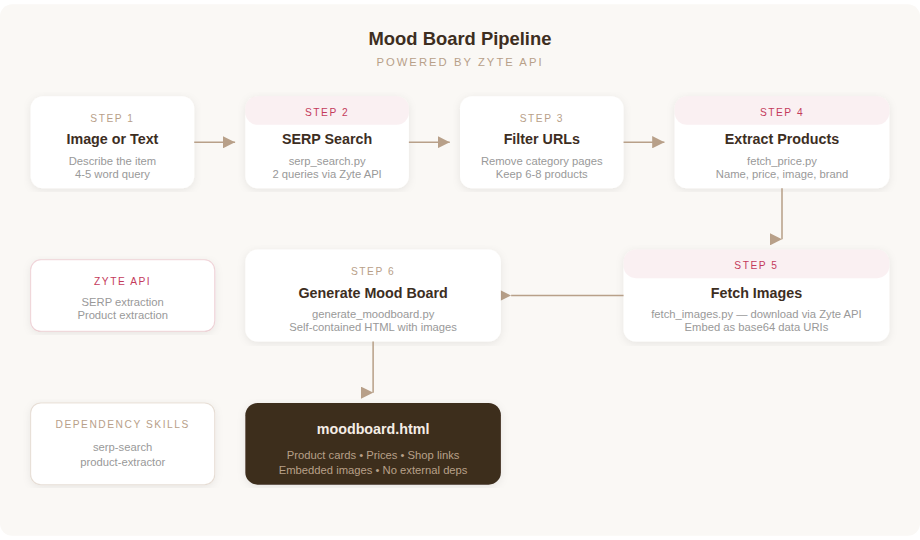

# Mood Board Generator

**Drop an image. Get a shoppable mood board.**

A [Claude Skill](https://support.anthropic.com/en/articles/11147625-what-are-skills) that turns a product image or text description into a styled HTML mood board with real product cards, prices, and buy links. Built on [Zyte API](https://www.zyte.com/zyte-api/) for web search and product data extraction.



---

Note: the `assets/` folder is used for this repo README preview. If you’re looking at a packaged Claude skill zip, it may not include those assets—product images in `moodboard.html` are embedded as base64 so they should still render.

## See it in action

**Input:** A photo of an outfit you like.

<p align="center">
  
</p>

**Prompt:** *"Find similar pieces for this full outfit — jacket, jeans, and heels."*

**Output:** A self-contained HTML mood board with 7 matching products across all three pieces, ranging from $56 to $650.



The skill identified three distinct items in the image (black asymmetric jacket with gold buttons, dark indigo wide-leg cropped jeans, black pointed-toe heels), ran separate searches for each, extracted real product data from seven e-commerce sites, and assembled the board. Total pipeline time: under two minutes.

---

## What it does

You give it a photo of an outfit (or a text description like "olive linen wide-leg pants"). It figures out what to search for, finds real products across the web, pulls structured data from each product page, downloads the images, and assembles everything into a self-contained HTML mood board you can open anywhere.

The output is a single `.html` file with no external dependencies. Product images are embedded as base64, so the board renders offline, in email, in Notion, wherever.



## How the pipeline works

The skill orchestrates three scripts and a filtering step into a six-stage pipeline:

**1. Describe the item** — Claude looks at the uploaded image (or cleans up a text description) and writes a tight 4-5 word search query. Shorter queries return more product pages. "black asymmetric gold button jacket" beats "women's black cropped asymmetrical blazer with gold-tone metal buttons long sleeve."

**2. Search for products** — `serp_search.py` hits Google via Zyte API's SERP extraction. Two slightly different queries run to broaden coverage (e.g., "black button jacket buy online" and "black cropped gold button blazer shop"). Results are combined and deduplicated.

**3. Filter URLs** — Category pages, search results, and browse pages get stripped out. The filter catches URL patterns like `/collections/`, `/browse/`, `/s?k=`, and `filterBy`. Only individual product pages survive. The first 6-8 make the cut.

**4. Extract product data** — `fetch_price.py` sends each URL to Zyte API's product extraction endpoint, which returns structured data: product name, price, currency, images, brand, color, variants, availability, and more.

**5. Fetch and embed images** — `fetch_images.py` downloads each product image through Zyte API and encodes it as a base64 data URI. This step exists because retailer CDNs block cross-origin image requests, which means external image URLs won't render in sandboxed environments (Claude artifacts, iframes, offline HTML). Embedding base64 solves this completely.

**6. Generate the mood board** — `generate_moodboard.py` takes the enriched product JSON and outputs a styled, responsive HTML page with product cards sorted by price, hover animations, and "Shop Now" links to each product page.

## Example output

Here's what a mood board looks like when you search for pieces matching a black-and-gold outfit (jacket, wide-leg jeans, and pointed heels):


Each card shows the product image, brand, name, price, and a direct link to the product page.

---

## Installation

### Prerequisites

- **Python 3.10+**
- **A Zyte API key** — [sign up for free](https://app.zyte.com/o/signup) (includes a free trial)
- **The `requests` library** — `pip install requests`

### As a Claude Skill

Download the `mood-board.skill` file from the [latest release](https://github.com/NehaSetia-DA/mood-board-skill/releases) and install it into your Claude workspace. The skill also depends on two other skills:

| Skill | What it does | Script |
|---|---|---|
| **serp-search** | Google search via Zyte API | `serp_search.py` |
| **product-extractor** | Structured product data extraction | `Fetch Price Script for Zyte.py` |

Install all three, set your `ZYTE_API_KEY` as an environment variable, and the mood board skill will chain them together automatically.

### Standalone (without Claude)

You can also run the scripts directly from the command line:

```bash
# Clone the repo
git clone https://github.com/NehaSetia-DA/mood-board-skill.git
cd mood-board-skill

# Set your API key
export ZYTE_API_KEY="your_key_here"

# Step 1-2: Search for products
python skills/serp-search/scripts/serp_search.py $ZYTE_API_KEY "black asymmetric gold button jacket buy online" > search_results.json

# Step 3-4: Extract product data from URLs (run for each product URL)
python "skills/product-extractor/skills /Fetch Price Script for Zyte.py" $ZYTE_API_KEY "https://example.com/product-page"

# Step 5: Fetch and embed images
echo '<product_data_json>' | python skills/mood-board/scripts/fetch_images.py $ZYTE_API_KEY > enriched_products.json

# Step 6: Generate the mood board
cat enriched_products.json | python skills/mood-board/scripts/generate_moodboard.py "black gold button jacket"

# Open moodboard.html in your browser
open moodboard.html
```

---

## Project structure

```
MoodBoard-Claude-Skill/
├── README.md                         # You are here
├── assets/                           # README images (used for repo README preview)
│   ├── moodboard_hero.png
│   ├── moodboard_cards.png
│   ├── pipeline_diagram.png
│   └── reference_image.jpg
├── Moodboard Similar Dresses.html  # Example static output
├── moodboard-blog.md                # Additional notes / examples
└── skills/
    ├── mood-board/
    │   ├── SKILL.md
    │   └── scripts/
    │       ├── fetch_images.py       # Downloads images + creates image_base64
    │       └── generate_moodboard.py
    ├── mood-board.zip                # Packaged skill
    ├── serp-search/
    │   ├── SKILL.md
    │   └── scripts/
    │       └── serp_search.py
    ├── serp-search.zip               # Packaged skill
    └── product-extractor/
        ├── SKILL.md
        └── skills/                  # Contains a file with spaces in its name
            └── Fetch Price Script for Zyte.py
```

## Product data schema

Each product flows through the pipeline as a JSON object. Here's what the extractor returns and what the mood board generator expects:

```json
{
  "name": "Asymmetrical Design Golden Button Blazer",
  "price": "69.0",
  "currency": "USD",
  "image": "https://cdn.example.com/product-image.jpg",
  "image_base64": "data:image/jpeg;base64,/9j/4AAQ...",
  "url": "https://example.com/products/golden-button-blazer",
  "brand": "COMMENSE",
  "color": "Black"
}
```

| Field | Source | Required by generator |
|---|---|---|
| `name` | Product extractor | Yes |
| `price` | Product extractor | Yes |
| `currency` | Product extractor | No (display only) |
| `image` | Product extractor | Fallback if no base64 |
| `image_base64` | `fetch_images.py` | Preferred image source |
| `url` | Product extractor | Yes (Shop Now link) |
| `brand` | Product extractor | No (used as card label) |
| `color` | Product extractor | No (fallback label if no brand) |

## URL filtering

Not every search result is a product page. The pipeline filters out URLs matching these patterns before extraction:

| Pattern | What it catches |
|---|---|
| `/collections/` | Shopify collection pages |
| `/browse/` | Browse/category pages |
| `/cat/` | Category pages |
| `/list/` | Product listing pages |
| `/s?k=` | Search results pages |
| `/s?field` | Filtered search results |
| `filterBy` | Faceted navigation |
| `refine/` | Refinement pages |
| `searchQuery` | Search query pages |
| `color_` | Color variant pages |
| `/v/` | Various filtered views |

---

## Why base64 images?

Product images are hosted on retailer CDNs (Shopify and other large fashion retailers’ static servers, etc.) that set restrictive CORS and hotlinking headers. When the mood board HTML renders inside a sandboxed environment like a Claude artifact, an iframe, or even some email clients, external image requests get blocked silently and the cards show up empty.

The `fetch_images.py` script solves this by routing image downloads through Zyte API (which handles anti-bot protection and CDN access), then encoding each image as a base64 data URI directly in the HTML. The tradeoff is file size: a mood board with 7 products runs about 750KB instead of 5KB. But it works everywhere, every time, with zero broken images.

The generator gracefully degrades. If `image_base64` is present, it uses that. If not, it falls back to the external `image` URL. If both fail, it shows a styled placeholder with the brand name.

## Customization

The HTML template lives in `generate_moodboard.py` as a single f-string. It's intentionally simple to modify. The color palette uses five values you can swap:

| Variable | Default | Used for |
|---|---|---|
| Background | `#faf8f5` | Page background |
| Text primary | `#3d2e1f` | Headings, card names, button bg |
| Text secondary | `#b8a089` | Labels, metadata, placeholder text |
| Accent | `#c43b5c` | Prices, hover states, item count |
| Card background | `#ffffff` | Product cards |

---

## Responsible use

This skill uses Zyte API to access publicly available product data from e-commerce websites. A few things to keep in mind:

- **Respect robots.txt and terms of service.** Zyte API handles compliance at the infrastructure level, but you should still be mindful of how you use extracted data.
- **This is a discovery tool, not a scraper.** The mood board links back to original product pages. It's designed to drive traffic to retailers, not replace them.
- **Rate limits matter.** The `fetch_images.py` script caps concurrency at 4 parallel downloads. If you're building on top of this, keep Zyte API rate limits in mind.

---

## Built with

- [Zyte API](https://www.zyte.com/zyte-api/) — SERP search, product extraction, and image fetching + all the hard stuff related to web scraping- proxy rotation, javascript rendering and ban management.  
- [Claude Skills](https://support.anthropic.com/en/articles/11147625-what-are-skills) — Skill framework for orchestration
- Python 3 + `requests`

